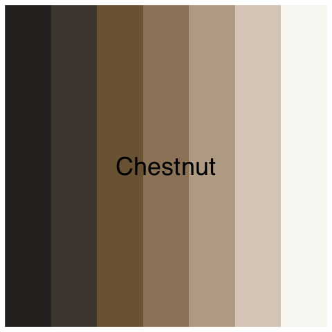
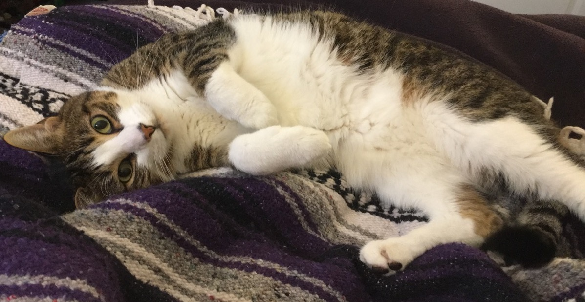
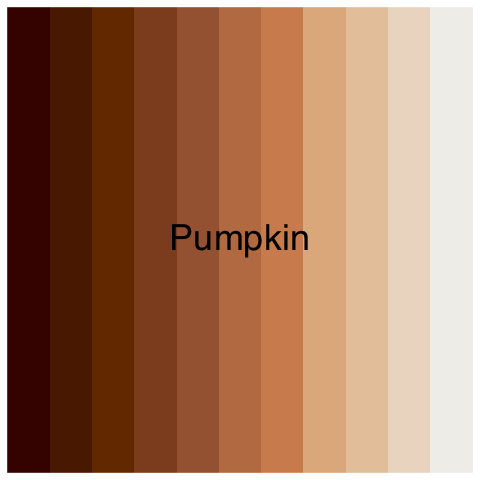
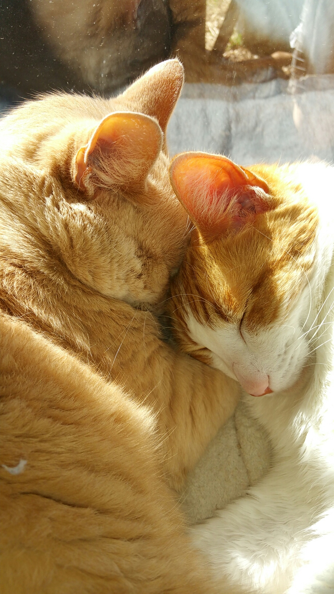
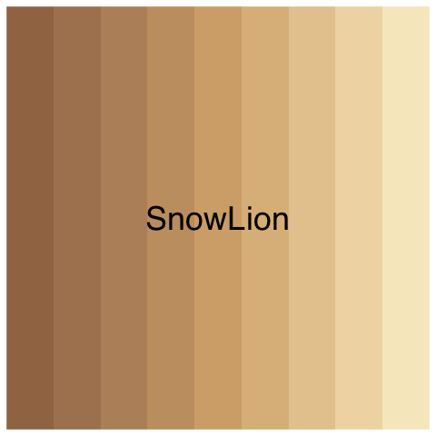
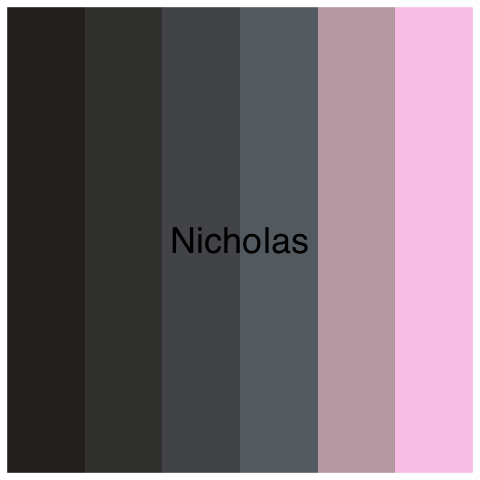
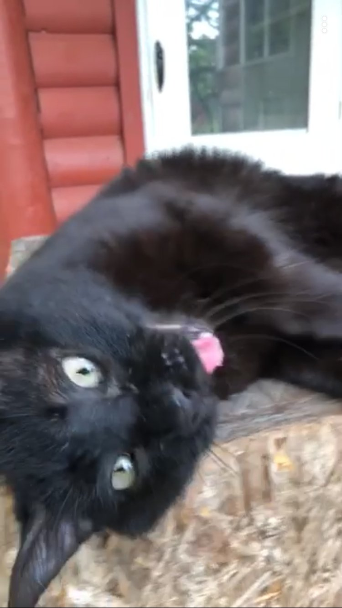
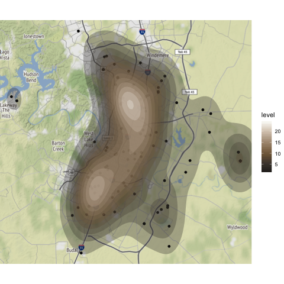

## Cat Color R palettes

Inspired by the [Pacific Northwest color palette](https://github.com/jakelawlor/PNWColors/), I wanted to make a palette based on something I love: my cats! I've included color palettes based on Chestnut (my cat), SnowLion, Pumpkin Seed, and Nicholas (cats from home). 

While shades of brown and orange probably won't be practically applicable in most settings (also it's hard to make a palette of a black cat), why not make your R graphics look as much like my cats as possible? 

I used the [Pantone Studio iPhone app](https://apps.apple.com/us/app/pantone-studio/id329515634) to extract colors, then [Chroma.js Color Palette Helper](https://gka.github.io/palettes) to make the colors colorblind friendly and arrange better. 

## How to Install Package
```r
install.packages("devtools") 
devtools::install_github("empalmer/catlette") 
```

## The cats

### Chestnut
```{r}
cat_palette(name="Chestnut",type="continuous")
```

<p float="left">
  
   
</p>

### Pumpkin (left)
```{r}
cat_palette(name="Pumpkin",type="continuous")
```


<p float="left">
  
   
</p>

### SnowLion (right)
```{r}
cat_palette(name="SnowLion",type="continuous")
```
<p float="left">
  
   
</p>

### Nicholas

```{r}
cat_palette(name="Nicholas",type="continuous")
```
<p float="left">
  
   
</p>

## Example

Location of stray pets picked up in Austin area, based on data downloaded November 15th 2019 from <https://data.austintexas.gov/Health-and-Community-Services/Austin-Animal-Center-Stray-Map/kz4x-q9k5>.

<center></center>


